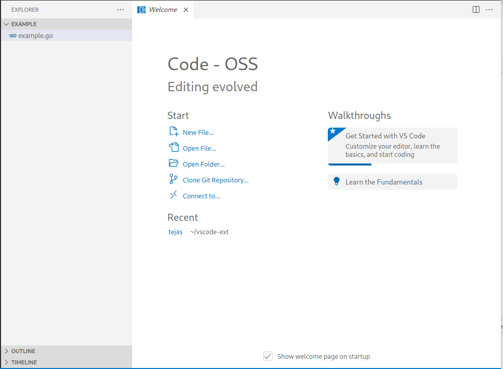
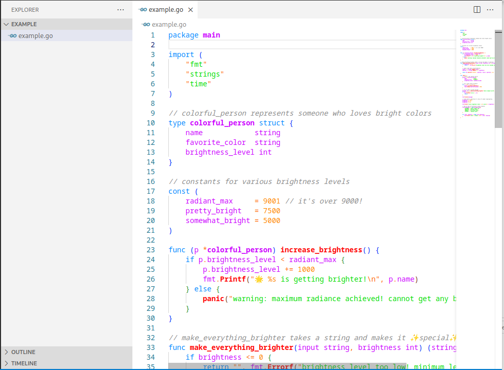
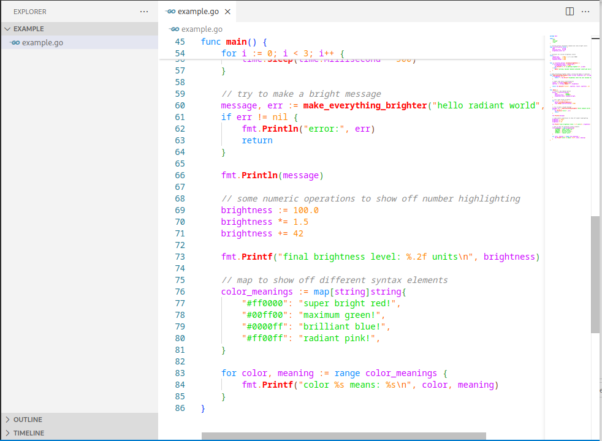

# ✨ tejas: probably the brightest vs code theme ever made

> **warning :**
> your eyes might never be the same

welcome to tejas, a theme that turns your code editor into a literal beacon of light. 

i took the word "tejas" very seriously (maybe too seriously).

a feast for eyes

### 🎯 this theme is perfect if you:

- think dark themes are for wimps
- code at 3am and need to stay awake
- want your code visible from the international space station
- believe more brightness = more productivity

### 🚀 how to install

1. grab the theme
2. find your sunglasses
3. slap it into vs code
4. maybe turn down your brightness ( weakling )
5. embrace the glow

### 💡 pro tips

- works great with welding goggles
- might attract moths to your workspace
- doubles as a night light

###  totally reasonable color choices

- `#FF0000` - red that screams "pick me"
- `#00FF00` - green that puts radioactive stuff to shame
- `#0088FF` - blue that makes the sky jealous
- `#FF00FF` - pink that startles unicorns
- `#FF8800` - orange because need more bright

### 📝 *real* reviews 

> "opened the theme and my cat started chasing the cursor reflections on the wall" - happy user

> "neighbors asked if i was running a lighthouse from my apartment" - satisfied developer

> "typing speed increased because i wanted to finish before retinal damage" - productive programmer

### 🤔 questions people might ask

q: is it too bright?
a: what's "too bright"?

q: will this make me a better coder?
a: you'll definitely code faster just to escape the light

q: can i use this at work?
a: depends on your workplace's stance on impromptu light shows

### 🌈 wanna help?

if you think it's not bright enough (you madlad), feel free to contribute:
- add more eye-searing colors
- push the boundaries of monitor capabilities
- make electricity bills higher
- challenge the known laws of physics

### 📜 license

mit (make it brighter)

---

**stay bright with tejas**

*note: i am not responsible for any sudden urges to wear sunglasses indoors or if your monitor tries to achieve consciousness*